# 运动星球

> 俱乐部球会组织，各种活动约起。
> 
---

# 如何申请俱乐部？

第1步：“我的”，“申请俱乐部”图标入口，点击进入申请俱乐部界面；

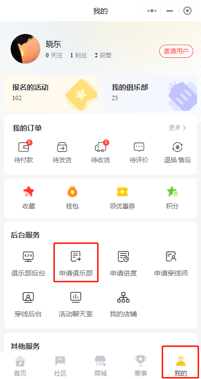

第2步：回到“我的”，“申请进度”页，查看俱乐部申请进度；

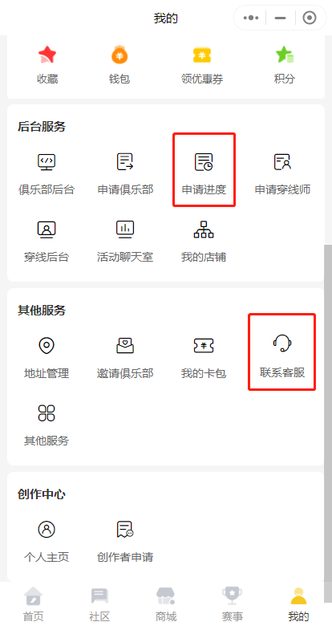

若还未审核，可在“我的”→“其他服务”→“联系客服”，联系平台客服进行审核；

     

# 发布活动

## 一：入口

**入口1**：在首页头部，便捷发布。

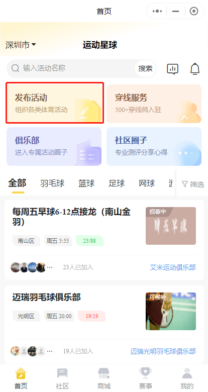

**入口2**：在管理后台，“活动管理”→“发布”入口进入活动发布页

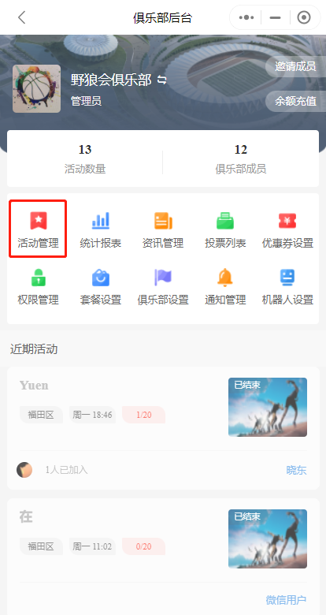

## 二：发布

* 第1步：“发布活动”页，依次选择或填入各项信息，点击发布即可；
  
* 第2步：活动发布成功，点“分享”可分享活动链接发给微信好友或微信群，点“查看详情”进入活动详情页；
  
##### **表单解释**

1. 收费项目：是附加收费项目，取消退款时间与取消报名时间。
   
2. 转让截止时间<取消时间<=开始时间<结束时间。
   
3. “活动频率”，选择“单次”时活动结束不会发布新的活动，选择“每周举办”时，上一活动结，会自动发布新的活动，时间上会加7天。
   
4. 勾选了“固定活动成员是否自动报名”，必须设置固定活动成员才可成功发布活动，固定活动成员会自动报名当前活动（余额不足报名失败）。
   
5. 设置了“会员优惠”，且报名人员有俱乐部会员等级时，报名费才会享受对应的优惠。
   
6. 请先设置俱乐部会员水平等级后，再开启限制会员水平等级报名，此项设置将会限制水平之外的会员和新人报名。
   
7. 报名者必填联系方式：因为微信注册默认不再强制用手机号授权注册，如果不熟的活动。建议开启此项，让报名成员先授权手机号，或手填上联系电话的方式。
   
8. 会员等级优惠，是每个等级报名的对应价格方案。
   
9. 会员卡优惠，是使用卡的优惠。与会员等级优惠是两个支付方案。不关联的两个方案。
   
     

# 活动查看报名

活动状态分别为：招募中、进行中、已结束。

1. 到进行中后，不可再报名。
   
2. 结束后，方可发起多退少补。可以发起多次。
   
活动所属的俱乐部管理员和会长可在两个地方查看报名列表：

活动详情页→报名列表、活动详情页→管理→报名名单，查看活动帐单（这里可以看到全部，包括已取消的报名记录）

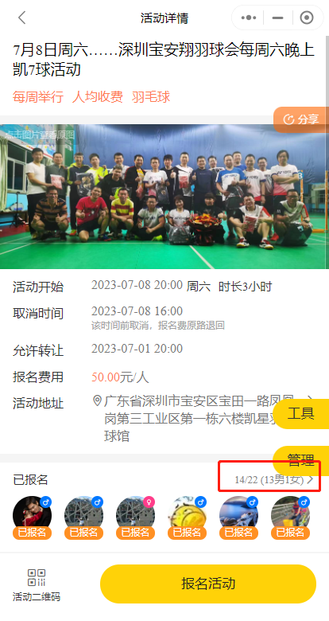

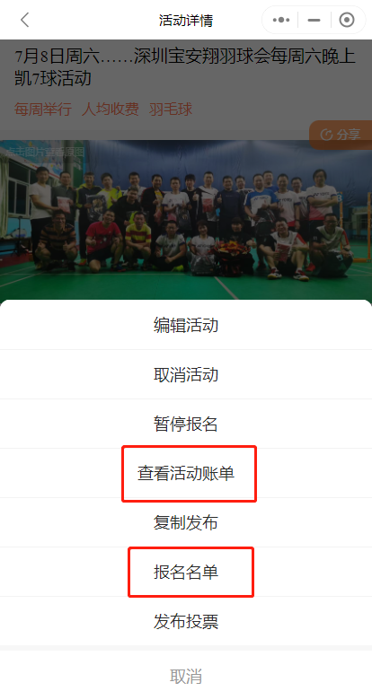

普通用户仅能在活动详情页→报名列表查看报名名单。这里查看到的是当前活动所有的报名信息。

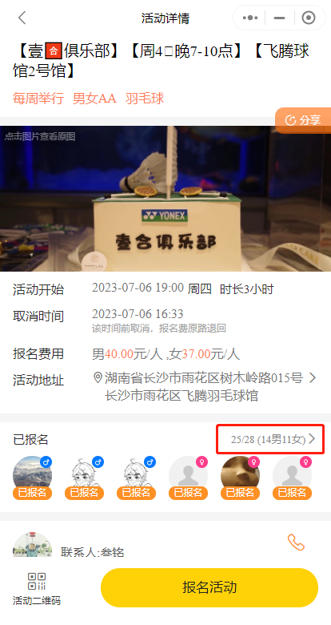

     

# 用户报名活动

报名分为正常报名和候补报名。

### 正常报名：

活动详情页，点击“报名活动”→“报名”页填好微信号和手机号→填写男多少名、女多少名，走完支付流程即可。

注意：活动限制男女人数时，分别对男女报名人数有限制。不限制男女人数时，只限制男女报名的总数。

### 候补报名：

活动发布者若未开候补，报名名额已满后，无法继续报名；反之，用户可以候补报名，待已报名用户取消报名空出名额后，候补报名者自动报名。

     

# 取消报名

管理员取消会员的操作,不受取消时间限制

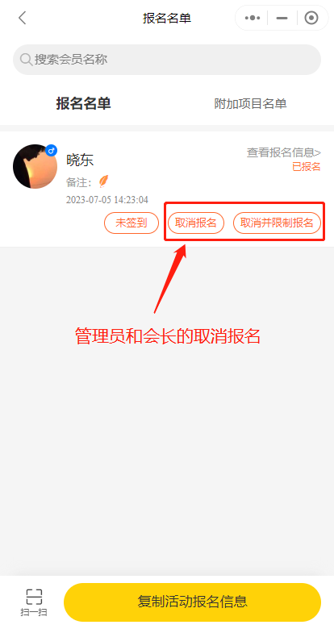

会员取消自己的报名，在没过取消时间之前可以自己取消。过了取消时间后，只能联系管理员或会长取消。

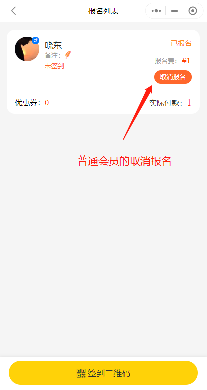

     

# 转让名额

***条件：活动名额已满且未过转让时间。***

仅支持转让自己的报名，转让后，接受者接受转让，且在付款前，转让者可以取消转让；

若接受者付款了，表示转让完成，报名名额转到了接受者这边。

     

# 怎么发起“多退少补”

注意：仅支持活动发起者本人发起多退少补，且活动发起者本人无法参与多退少补的少补

第1步：活动发布者，选择自己发布过且已到期的活动，点击进入活动详情页，“管理”        →“发起多退少补”；

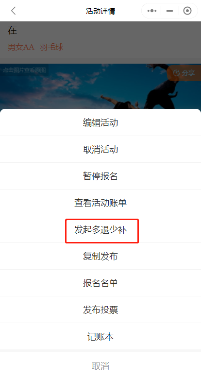

第2步：选好多退少补模式、各金额，选择“收”或“退”，初步设定各报名人员的金额；

第3步：根据各报名人员的报名费，计算出需要“退”或“补”的金额，选好“退”或者“补”，填好计算出的金额；

第4步：填写多退少补的备注说明，点击“发起多退少补收款”；

第5步：确认“退”和“补”金额，确定；

第6步：输入微信支付密码，支付多退的金额；同时，生成“多退少补的支付链接”，可以发给需要少补的报名人员或者活动微信群，提醒需要少补的人员补交报名费；

可以多次发布多退少补，如果会员线下转过款了。也可以取消已生成的订单。

     

# “充值”与“提现”是怎样的

“充值”目前分普通会员充值、俱乐部余额充值。其中普通会员充值由“我的”页→“余额”→“充值”，充到普通会员自己的平台个人余额里；俱乐部余额充值由“我的”页→“我的俱乐部”→平台余额向右箭头→“充值”，充到俱乐部的余额里。俱乐部会员余额是不会过期。

“提现”是对可提现余额的提现，提现到当前会员用户的微信余额里。目前每人每天仅支持最多10次提现，每人每天提现总额最多5000元。

     

# 套餐卡功能，即将上线

> 即将上线，预计8月初上线。
> 
套餐卡是一种新的支付结算方案。在报名活动时选择卡支付。如包月免费的卡，报名时免费。使用优惠卡时，参照活动中设置对应卡的价格。

即时生效类型的包月扣费卡可以续费。

固定有效期的卡，不可以续费。

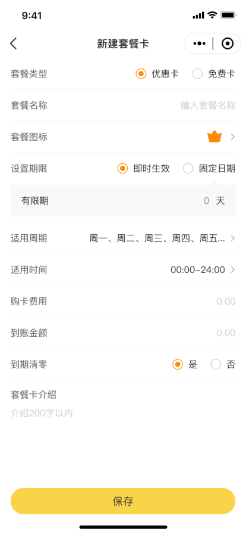

支持在线售卖。会员自动购买，在报名活动时，使用对应的套餐卡支付。

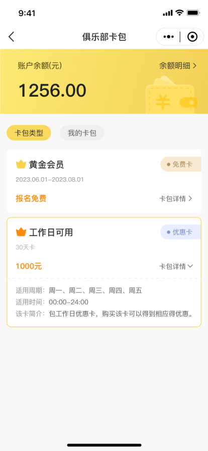

管理员和会长能看到，售卡记录。也能操作这订单退款。

     

# “报名账单”怎么查看？

前提：当前用户为活动所属俱乐部的会长或者管理员。

“俱乐部”页→选择并点击活动所属俱乐部→“活动”→选择该活动→“管理”→

“查看活动账单”，即可查看当前活动报名的账单明细。

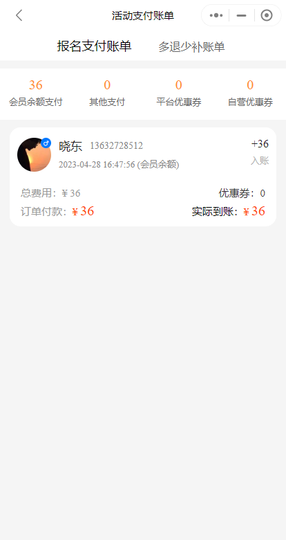

其中，会员余额支付总额：指的是使用俱乐部会员余额支付来报名产生的账单；

其他支付总额：指的是使用个人平台余额支付或者微信余额支付来报名产生的账单；

     

# 俱乐部如何管理俱乐部下的成员？

由“我的”→“管理后台”→选定俱乐部→“俱乐部成员”，可以做以下操作：

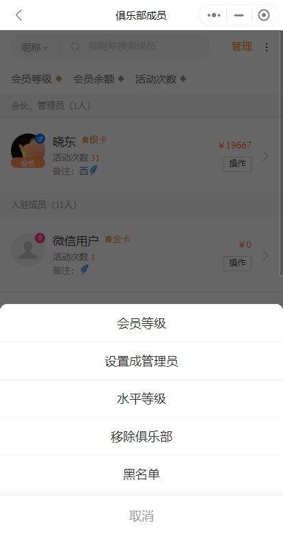

“设置管理员”：将俱乐部下成员设为管理员，成员成为管理员后，可设置会员等级、将非会长成员移出俱乐部、拉黑非会长成员、设置会员等级和撤销拉黑会员；

“设置等级”：将选定成员设置会员等级，活动报名时享会员优惠；

“设置水平等级”：将选定成员设置会员等级，活动报名时享会员优惠；

“移出俱乐部”：将非会长成员移出俱乐部；

“拉黑”：将非会长成员拉黑，不再享受俱乐部成员福利和优惠。拉黑后，出现在黑名单页；

     

# 八人转工具

> 当前八人转，支持三种，双打轮转、单打轮转、固双轮转
> 
支持选中用户头像，筛选当前用户的所有轮次

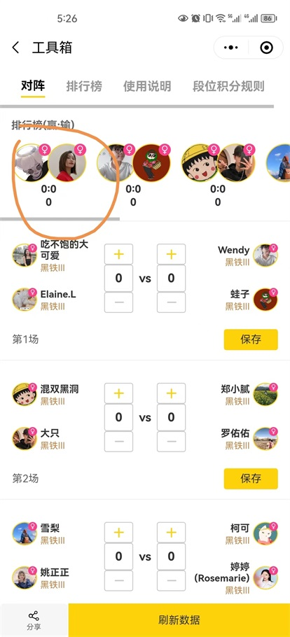

     

# 公众号消息推送，比小程序订阅更稳定长久推送。

 关注 [联合运动] 微信公众号，可以及时收到活动信息的推送。

“我的”→“其他服务”→“关注微信公众号”，进入公众号文章，官方的联合运动微信公众号介绍。 1：左上角打开公从号关注； 2：长按识别二维码关注。
