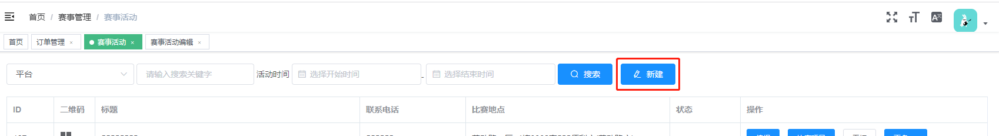
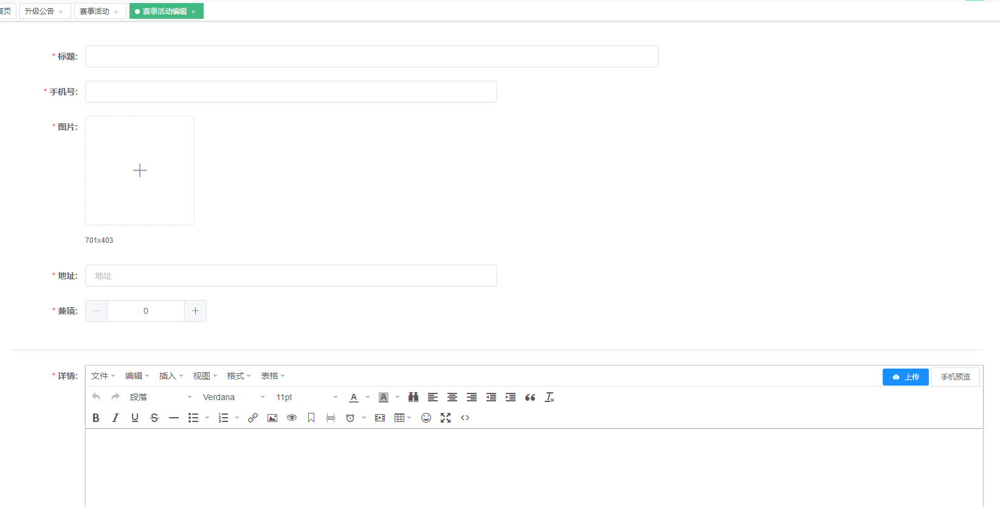
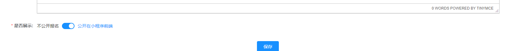
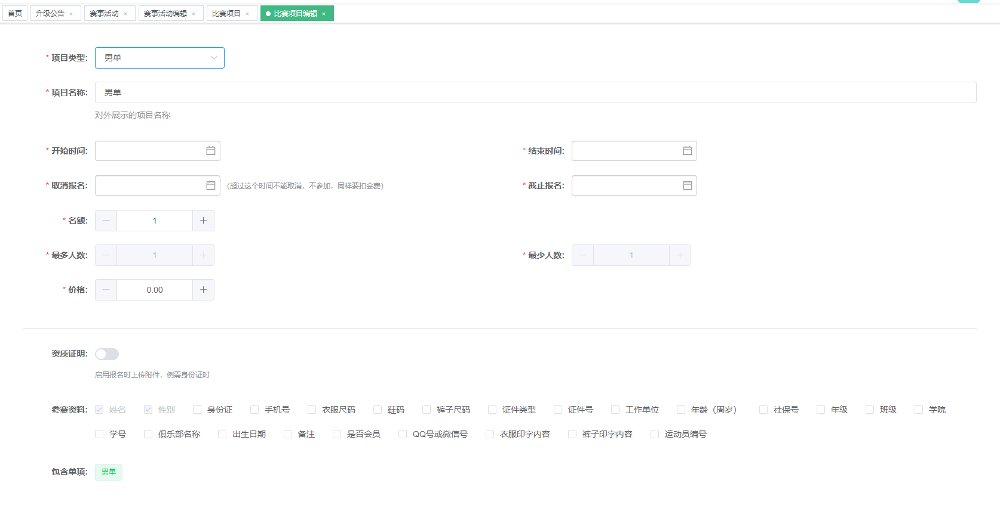
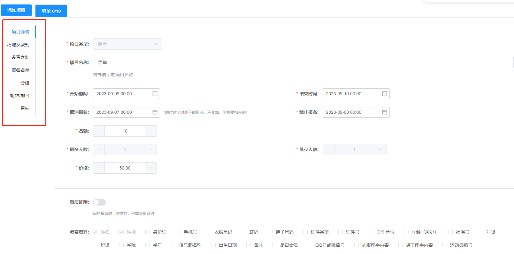
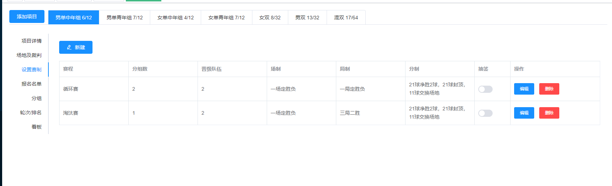
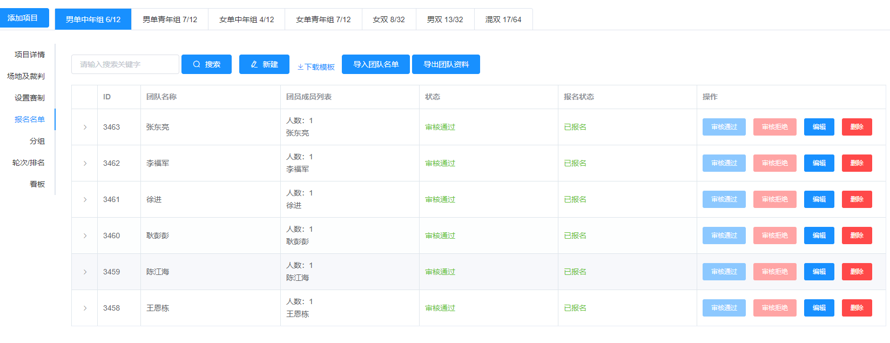
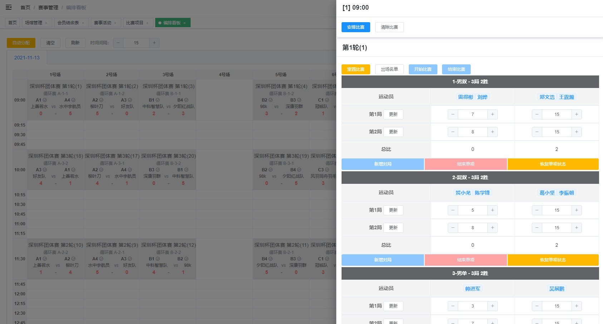

# 赛事系统

> 大型赛事活动管理，按报名人数，分组好后，自动生成对战轮次

---

## 发布赛事

1：在赛事管理列表上方，找到新建入口，进入创建赛事；

  

2：填写赛事的基本信息，赛事的标题，对外联系的手机号，赛事封面，赛地举办地址，报名是否可以兼项，赛事介绍以及是否公开。

  

3：在未准备公开之前，也可以把不公开。或本身这个比赛就是不公开报名的

  

4；保存赛事信息后，操作列表，找到比赛项目这一入口，进行比赛的项目设置。

  

## 赛事项目的创建及设置

1：赛事项目，有男单、男双、女单、女双、混双、团体。如果项目类型为团体，那就会在团体里再设置包含单项有哪些

2：保存后，会出现更多的内容，场地及裁判是各项比赛共用的，裁判也不用指定场地。可以由裁判长灵活安排。

3：赛制：有循环赛和淘汰赛之分。**在分组之前，在先设置好赛制**;

  

4：报名名单：可以线上报名或按模板导入，在裁止时间之后可以审核名单。审核不通过，原报名支付订单金额将原路退回。

  

5：分好组后，就可以在软次中，按系统生成的对战顺序。直接保存。就可以在看板上，可以先按自动分配出来再拖动调整到对应的场地时间上去；

