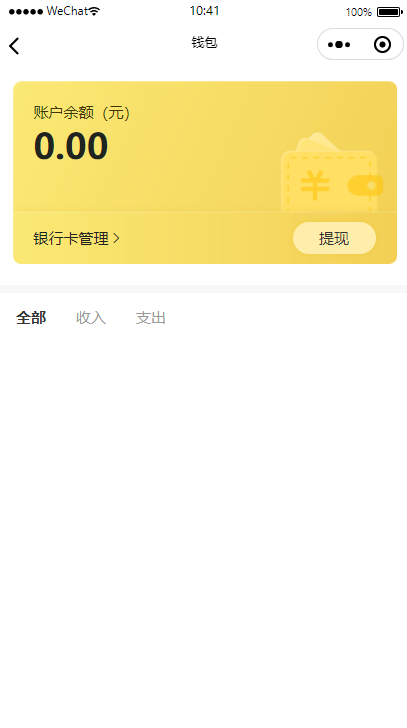

# 新钱包功能版本上线；解决微信商户号 分成基本户仅进帐，运营户仅出帐，需财务处理才能提现问题

---
# 新钱包功能及新版本区别
## 一：从小程序中，我的->钱包->新钱包->绑定银行卡四步；（运动星球、联合场馆、联合穿线师、联合运动、传奇运动）操作流程通用

第一步：我的->钱包

第二步：点击新钱包，进入； 新的支付版本后将新的订单结算到新钱包。旧钱包，原来已经支付的还是结算到旧的可提现余额。

第三步：填定个人银行卡信息，提交前需同意用户授权协议

第四步：绑卡成功，后续新的微信支付订单，将结算到此

## 二：软之前变动场景

一：多退少补中，多退改成原订单支付金额做部份退款；
二：平台余额支持将下线；
其他小程序业务没区别
     

